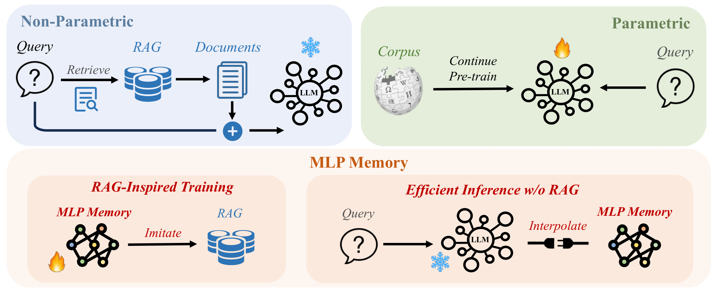
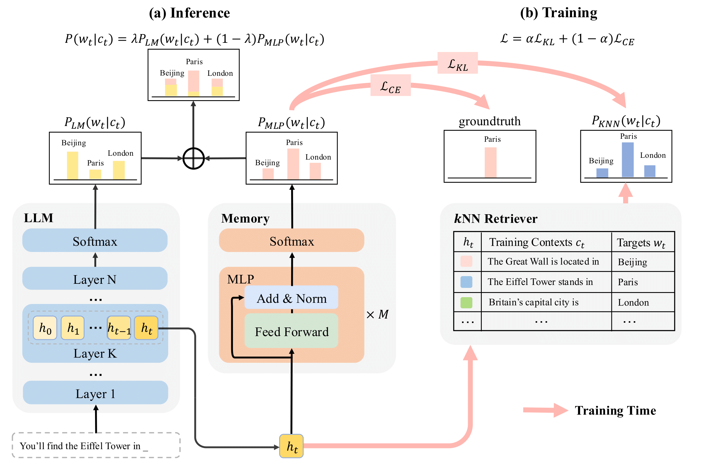

#  MLP Memory: A Retriever-Pretrained Memory for Large Language Models

<div align="center">

[](https://arxiv.org/pdf/2508.01832)
[](https://huggingface.co/Rubin-Wei/MLPMemory-1B-wikipedia-for-Mistral-7B-v0.3)


</div>

<p align="center" style="font-size: larger;">
  <a href="https://arxiv.org/pdf/2508.01832">MLP Memory: A Retriever-Pretrained Memory for Large Language Models</a>
</p>

<p align="center">

</p>


## 📖 Overview  

MLP Memory introduces a retriever-pretrained parametric memory that bridges the gap between retrieval-augmented generation (RAG) and parametric fine-tuning. Instead of explicitly fetching documents, it learns to internalize retrieval patterns by pretraining an MLP to mimic kNN retrievers over the entire pretraining corpus. It offers several key advantages.

- ⚙️ **End-to-End Differentiable** — Unlike non-parametric retrievers, MLP Memory is fully parameterized and supports gradient flow, enabling joint optimization with the base model.  
- 💾 **Highly Compressed Knowledge** — Compresses massive retrieval stores (e.g., 40 TB for 5 B tokens) into a compact 1 B-parameter MLP (~4 GB) while improving overall performance.  
- ⚡ **Efficient Inference** — Eliminates retrieval overhead, achieving faster inference than RAG and kNN-LM, with constant speed regardless of corpus size.  
- 🧠 **Long-Term Memory** — Functions as a durable repository capturing the full pretraining corpus, extending beyond short-term context memory.  

Unlike retrieval-augmented methods that suffer from high latency and shallow integration, or parametric fine-tuning approaches that risk catastrophic forgetting, MLP Memory achieves both efficiency and effectiveness, establishing a new paradigm for retrieval-inspired knowledge augmentation in large language models.

<p align="center">

</p>

## 🚀 Quick Start

### 🔧 Environment Setup

We run on **CUDA 12.1** with **faiss-gpu 1.8.0** as the core dependency. To quickly set up the environment, simply create it from the provided configuration file:


```bash
conda env create -f environment.yml
conda activate mlpmemory
```

### 📊 Evaluate and Use MLP Memory

We provide the checkpoint of gpt2-large MLP Memory used in our experiments 🤗[gpt2-large MLP Memory](https://huggingface.co/Rubin-Wei/MLPMemory-gpt2-large). Simply download this checkpoint and 🤗[wikitext-103 dataset](https://huggingface.co/datasets/Salesforce/wikitext) from huggingface and run the following scripts:

#### 📝 Data Preprocessing
```bash
# scripts/preprocess_dataset.sh
TOKENIZER="/path/to/tokenizer(model)/directory"
OUTPUT_DIR=./dataset/wikitext-gpt2

python utils/preprocess_dataset.py \
    --dataset_name /path/to/wikitext \
    --dataset_config_name wikitext-103-raw-v1 \
    --tokenizer_path ${TOKENIZER} \
    --output_dir ${OUTPUT_DIR} \
    --num_proc 1
```

#### 📈 Evaluate Base Model
```bash
# scripts/evaluate_base.sh
DATASET=/path/to/dataset
MODEL=/path/to/base/model
OUTPUT_DIR=tmp/

NCCL_P2P_DISABLE=1 NCCL_IB_DISABLE=1 CUDA_VISIBLE_DEVICES=0 python \
    -m train_base \
    --model_name_or_path ${MODEL} \
    --dataset_name ${DATASET} \
    --per_device_eval_batch_size 8 \
    --do_eval \
    --eval_subset test \
    --output_dir ${OUTPUT_DIR} \
    --report_to none
```

#### 🎯 Evaluate with MLP Memory
```bash
# scripts/evaluate_joint.sh
DATASET=/path/to/dataset
MODEL=/path/to/base/model
KNN_PATH=/path/to/mlp/memory
OUTPUT_DIR=tmp/

python -m evaluate_joint \
    --do_test \
    --model_name_or_path ${MODEL} \
    --dataset_name ${DATASET} \
    --dataset_split_name test \
    --per_device_eval_batch_size 8 \
    --output_dir ${OUTPUT_DIR} \
    --knn_temp 1 \
    --lmbda 0.25 \
    --knn_generator_path ${KNN_PATH} \
    --report_to none
```

### 🏆 Performance Results on WikiText-103

|   Model    | #Params |  PPL  |
|:----------|:-----------:|:----:|
| GPT2-large-vanilla | 774M | 15.80  |
| GPT2-large-finetuned | 774M | 10.42 |
| GPT2-xl-finetuned | 1.5B | 10.16 |
| GPT2-large-finetuned + MLPMem | 774M + 774M| **9.51** | 


### 💡 Generation Example
```bash
# demo/generation_example.py
python -m demo.generation_example
```


**📊 Generation Results Comparison:**

| Model | Generated Continuation |
|-------|------------------------|
| **Base Model** | *"...who sings i can't take my eyes off of you?? The answer is: Andy Williams..."* |
| **+MLP Memory** | *"...who sings i can't take my eyes off of you?? The answer is: **Frankie Valli**. ;)..."* |


## 🛠️ Training MLP Memory

### 📁 Repository Structure

Our codebase is organized as follows to facilitate both training and evaluation:

```
MLPMemory/
├── demo
│   └── generation_example.py      # Generation demonstration
├── downstream
│   ├── eval_qa.py                 # QA tasks evaluation
│   └── eval_qa.sh                 # Evaluate QA tasks
├── knn_utils
│   ├── build_index.py             # build FAISS index for efficient search
│   ├── saveEmbedMulti.py          # Save embeddings with multi-GPU support
│   └── saveKNNMulti.py            # Search and save KNN distributions
├── models
│   ├── __init__.py
│   ├── mlpGPT2.py                 # MLP Memory for GPT2
│   ├── mlpLlama.py                # MLP Memory for Llama
│   ├── mlpMemory.py               # Class for MLP Memory Generation & Training
│   └── mlpMistral.py              # MLP Memory for Mistral
├── scripts
│   ├── evaluate_base.sh           # Evaluate base model
│   ├── evaluate_joint.sh          # Evaluate with MLP Memory
│   ├── preprocess_dataset.sh      # Preprocess datasets
│   ├── save_pipeline.sh           # Complete KNN signal pipeline
│   ├── train_mlpmem_offline.sh    # Train MLP Memory offline
│   └── train_mlpmem_online.sh     # Train MLP Memory online
├── utils
│   ├── cal_loss.py                # Loss calculation utilities
│   └── preprocess_dataset.py      # Dataset preprocessing
├── environment.yml                # Environment configuration
├── evaluate_joint.py              # Joint evaluation interface
├── train_base.py                  # Base model training/evaluation
├── train_mlpmem_offline.py        # MLP Memory training offline
└── train_mlpmem_online.py         # MLP Memory training online
```

### 🔄 Training Pipeline

#### 1️⃣ Preprocess Dataset
Tokenize and group text for efficient processing:
```bash
bash scripts/preprocess_dataset.sh
```

#### 2️⃣ Build KNN Training Signals

Three-step process for creating supervision signals:

- Save Embeddings

Extract and save hidden representations from the pretrained model:
```bash
accelerate launch \
    --config_file ${ACCELERATE_CONFIG} \
    -m train_base \
    --model_name_or_path ${MODEL_TO_SAVE} \
    --dataset_name ${DATASET} \
    --do_eval --eval_subset ${SUBSET} \
    --per_device_eval_batch_size ${BATCH_SIZE_EVAL} \
    --output_dir ${OUTPUT_DIR} \
    --dstore_dir ${DSTORE_DIR} \
    --save_knnlm_dstore \
    --report_to none
```

- Build IVFPQ Index

Create an efficient index for fast nearest neighbor search:
```bash
python -m knn_utils.build_index \
    --dstore_path ${DSTORE_PATH} \
    --num_keys_to_add_at_a_time ${NUM_KEYS_TO_ADD} \
    --ncentroids ${NCENTROIDS} \
    --code_size ${CODE_SIZE} \
    --probe ${PROBE}
```

- Search KNN Distributions

Generate KNN probability distributions as training signals:
```bash
accelerate launch \
    --config_file ${ACCELERATE_CONFIG} \
    -m knn_utils.saveKNNMulti \
    --model_path ${MODEL_TO_SAVE} \
    --dstore_path ${DSTORE_PATH} \
    --val_path ${VAL_PATH} \
    --index_path ${INDEX_PATH} \
    --output_path ${OUTPUT_PATH} \
    --k ${K} \
    --knn_temp ${KNN_TEMP} \
    --probe ${PROBE} \
    --batch_size ${BATCH_SIZE_KNN} \
    --ignore_first True \
    --knn_gpu
```

The complete pipeline is available in:
```bash
bash scripts/save_pipeline.sh
```

> [!IMPORTANT]
> Both embedding saving and KNN distribution search support multi-card multi-node inference/searching. Ensure your `accelerate` configuration is properly set up for distributed computing to maximize efficiency.

#### 3️⃣ Start Training

Depending on your storage and compute setup, MLP Memory supports two training modes:

🧱 **Offline Training**

If you have sufficient storage, we recommend offline training.
In this mode, all base model embeddings are precomputed and stored before training begins.
This approach requires more disk space but enables faster training since embeddings are directly loaded from disk.

To prepare the embeddings, first run the **Save Embeddings** step.

Then start the offline training process:

```bash
# scripts/train_mlpmem_offline.sh
bash train_mlpmem_offline.sh
```


🌐 **Online Training**

If storage is limited, you can opt for online training.
In this mode, embeddings are computed dynamically during training rather than pre-stored, which greatly reduces disk usage but incurs a small runtime overhead.
```bash
# scripts/train_mlpmem_online.sh
bash train_mlpmem_online.sh
```

## 💡 Downstream Evaluation
To eval base model, remove `--use_neural_knn` and run:
```bash
# downstream/eval_qa.sh
bash downstream/eval_qa.sh
```

To eval base model + MLP Memory, run:
```bash
# downstream/eval_qa.sh
bash downstream/eval_qa.sh
```

## 🙏 Acknowledgments

This implementation is inspired by the excellent work in [knn-transformers](https://github.com/neulab/knn-transformers) and [MemoryDecoder](https://github.com/LUMIA-Group/MemoryDecoder). We are grateful for their pioneering contributions to retrieval-augmented language modeling.

## 📧 Contact

For questions and discussions, feel free to email: **weirubinn@gmail.com**

## 📚 Citation

If you find MLP Memory helpful in your research, please consider citing:

```bibtex
@article{wei2025mlp,
  title={MLP Memory: Language Modeling with Retriever-pretrained External Memory},
  author={Wei, Rubin and Cao, Jiaqi and Wang, Jiarui and Kai, Jushi and Guo, Qipeng and Zhou, Bowen and Lin, Zhouhan},
  journal={arXiv preprint arXiv:2508.01832},
  year={2025}
}
```